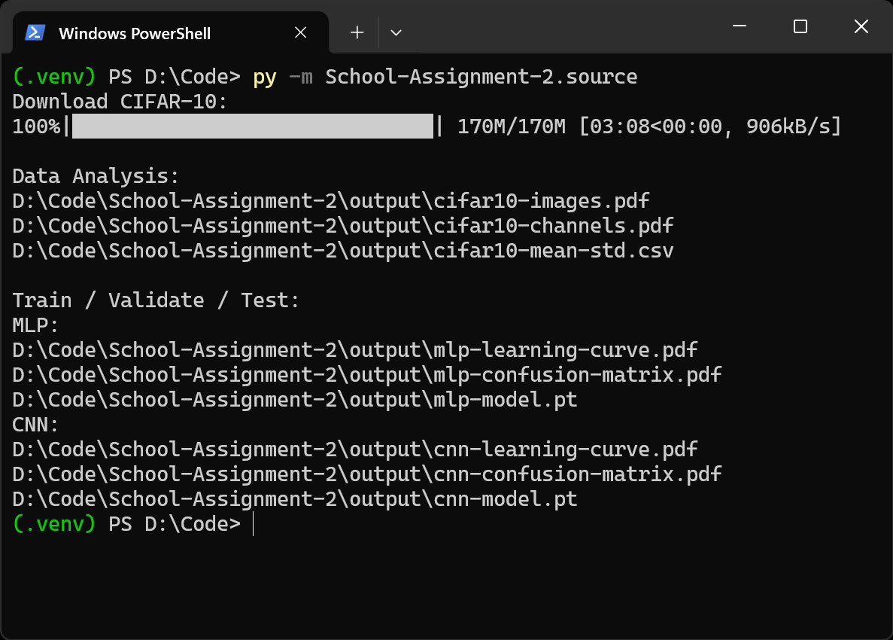

<!-- # Football Players Statistical Analysis -->
    
<!-- A school project involves collecting and analyzing football players statistical data from the 2024-2025 Premier League. -->

<!-- Outputs directories are displayed on terminal. Total runtime should be around 3 minutes (hopefully). -->

## Contributors
- [@Ka-raS](https://github.com/Ka-raS)
- [@phamquocdow](https://github.com/phamquocdow)

## Dependencies
- [**python 3.10.0**](https://www.python.org/downloads/release/python-3100/)
- [**pytorch**](https://pypi.org/project/scikit-learn/) - Deep Learning
- [**matplotlib**](https://pypi.org/project/matplotlib/) - Plotting Histograms And Graphs

## Installation

1. Clone Repo:
    ```bash
    git clone https://github.com/Ka-raS/School-Assignment-2.git
    cd School-Assignment-2
    ```

2. Install Package Dependencies:
    ```bash
    pip3 install -r requirements.txt
    ```

    Alternatively, if you want to install packages in the latest version
    ```bash
    pip3 install torch matplotlib
    ```

3. Run Program:
    ```bash
    python3 -m source
    ```

Additionally, you can compile report.tex through [MikTex](https://miktex.org/download).
```bash
cd reports
pdflatex report.tex
```

<!-- 
## Screenshot

<div align="center">
  
</div>
-->